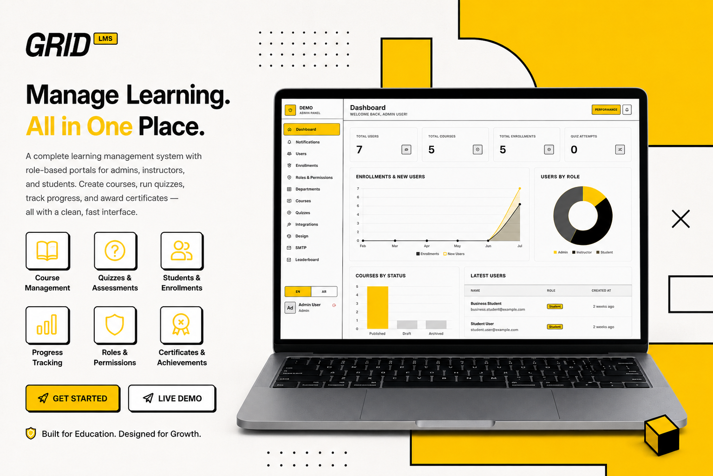

# GridLMS

A multi-tenant Learning Management System built with **Laravel 12**, **Livewire 4**, and **Tailwind CSS**. Designed for schools, universities, and organizations to run their own branded LMS with separate subdomains, isolated databases, and full course management — including a gamified points/XP system, YouTube playlist import, AI quiz generation, department management, admin broadcast notifications, and bilingual RTL support.



## Features

### Multi-Tenancy
- Each tenant (school/organization) gets its own subdomain and isolated database
- Central API for tenant registration and management
- Powered by [`stancl/tenancy`](https://tenancyforlaravel.com/)

### Role-Based Access
| Role | Capabilities |
|------|-------------|
| **Admin** | Full system control — manage users, courses, quizzes, design config (including logo), leaderboard monitoring, integrations, system logs, roles & permissions, departments, SMTP settings, Pulse performance monitoring |
| **Instructor** | Create and manage courses, sections, lessons (text/video), quizzes, assignments, grade submissions, import YouTube playlists |
| **Student** | Browse/enroll in courses, complete lessons, take quizzes, submit assignments, earn certificates, earn XP points, compete on the leaderboard |
<!-- | **Custom Roles** | Dynamic permission-based sidebar — create roles with any permission combination via the admin panel; navigation adapts automatically based on granted permissions | -->

### Course Management
- Courses organized into sections with lessons (text, video, quizzes)
- Video hosting via AWS S3 with metadata extraction (getID3, FFmpeg) and Plyr player, or paste any YouTube URL
- **Import entire YouTube playlists** — paste a playlist URL to auto-create a section with all videos as lessons
- Progress tracking — lessons marked complete, quiz scores tracked, enrollment status updated, XP points awarded
- Certificate of Completion (PDF download via dompdf with full Arabic RTL support)

### Departments
- Create and manage departments to group users and courses
- Users belong to a department; students see courses filtered by their department
- Courses with no department assignment are visible to all students
- Department management via admin panel with full CRUD and role-based access control

### Gamification & Leaderboard
- **Points/XP System** — +10 per lesson, +50 per quiz pass (+10 bonus for ≥90%), +100 per course completion
- **Student Leaderboard** — ranked table with medals, your rank and points displayed at the top, info card explaining how to earn points
- **Admin Leaderboard Monitor** — searchable, paginated view of all students with stats cards (total/average/highest points)

### Assessments
- **Quizzes** — Multiple-choice/single-choice/true-false with configurable pass percentage, re-attempts, and max attempts
- **AI Quiz Generation** — Generate quizzes automatically from lesson content using OpenRouter API (DeepSeek model). Select lessons, number of questions, and types — AI creates questions, options, and correct answers
- **Assignments** — File-based submissions with instructor grading, feedback, and late-submission policy

### Payments
- **Stripe** — Card payments via Stripe Elements with 3D Secure support
- **PayPal** — Redirect-based payments via PayPal API
- Credentials managed through the admin Integrations panel

### Notifications
- 12 notification types: enrollment confirmations, quiz results, assignment submissions/grades, course completion, due-soon reminders
- **Admin Broadcast Notifications** — Send targeted notifications to specific users via a searchable multi-select modal with chunked delivery

### Performance Monitoring
- **Laravel Pulse** — Real-time performance monitoring per tenant (slow queries, jobs, cache, usage)
- Accessible via the admin dashboard with role-gated access (`viewPulse` gate)
- Pulse tables run per-tenant

### Design System
- Neo-brutalist aesthetic — bold borders (2px black), sharp corners, high contrast, yellow #FFD600 accents
- Per-tenant color customization (primary, surface, chart colors) and **logo upload** via admin Design Config
- Logo stored on S3, served via CloudFront, displayed in all sidebars and guest layout
- CSS custom properties with live preview
- Grid-pattern background with crosshair dots

### Internationalization
- Full bilingual support: **English** and **Arabic** (RTL with Cairo font)
- Language switcher in sidebar and mobile dropdown
- `dir="auto"` on all user-generated text (questions, options, lesson content, titles) for correct bidirectional rendering
- Certificate PDF uses Unicode RLE/PDF control characters for proper Arabic text in DomPDF

### Security
- Content Security Policy headers with tenant-origin awareness (YouTube frame-src whitelisted)
- XSS prevention: `Sanitizer::cleanHtml()` on lesson content input, `e()` on output
- CSP `form-action` restricted to `'self'`
- Video upload path traversal protection (randomized filenames via `Str::random()`)
- Sanctum token expiration set to 1 year
- CORS restricted to `APP_URL` only
- **API Rate Limiting** — 10 requests/min for auth endpoints, 60/min for authenticated API, 10/min for guest API
- User import generates strong 16-character passwords (exposed in import results)
- Login throttling, strong password rules, session security
- Security event logging (logins, logouts)
- HTTPS enforcement in production

### Updates & Changelog
- Public `/updates` page with a timeline showing version history (v1.0–v1.6+)
- No authentication required — visible to all visitors
- Livewire component with structured release entries

### Sitemap
- Daily sitemap generation command (`php artisan sitemap:generate`)
- Iterates all active tenants and their custom domains
- Registers with search engines for SEO

## Tech Stack

| Layer | Technology |
|-------|-----------|
| **Backend** | Laravel 12, PHP 8.3+ |
| **Frontend** | Livewire 4, Alpine.js, Tailwind CSS 3, Vite |
| **Database** | MySQL (per-tenant), Redis (cache & sessions) |
| **File Storage** | AWS S3 via Flysystem |
| **CDN** | AWS CloudFront |
| **Payments** | Stripe, PayPal |
| **Video** | FFmpeg, getID3, Plyr |
| **PDF** | dompdf (certificates) |
| **Rich Text** | Quill editor |
| **Multi-Tenancy** | stancl/tenancy |
| **Auth** | Laravel Breeze (Volt), Laravel Socialite (Google OAuth) |
| **API** | Laravel Sanctum |
| **Roles** | spatie/laravel-permission |
| **Testing** | Pest PHP |
| **Notifications** | Database (in-app), Mail |
| **Monitoring** | Laravel Pulse, Debugbar, Pail |
| **AI** | OpenRouter API (DeepSeek) for quiz generation |

## Architecture

```
                        ┌─────────────────────┐
                        │   Central App        │
                        │   (gridlms.online)   │
                        │                      │
                        │  Tenant Registration │
                        │  API (Sanctum)       │
                        │  Landing Page        │
                        └──────────┬───────────┘
                                   │ stancl/tenancy
                        ┌──────────▼───────────┐
                        │  Tenant A             │
                        │  (school1.gridlms...) │
                        │  ┌─────────────────┐  │
                        │  │ Isolated DB     │  │
                        │  │ Users, Courses, │  │
                        │  │ Quizzes, etc.   │  │
                        │  └─────────────────┘  │
                        └───────────────────────┘
                        ┌───────────────────────┐
                        │  Tenant B             │
                        │  (school2.gridlms...) │
                        │  (same structure)     │
                        └───────────────────────┘
```

### Directory Layout

```
app/
├── Actions/              # Reusable action classes (Quiz, Logout)
├── Console/Commands/     # Artisan commands (CreateTenant, GenerateSitemap)
├── Http/
│   ├── Controllers/      # Payment, API, Auth, GoogleAuth controllers
│   └── Middleware/        # SecurityHeaders, SetLocale, ForceHttps, etc.
├── Imports/              # UsersImport (Excel)
├── Livewire/
│   ├── Admin/            # Admin panel components (Users, Courses, Roles & Permissions, etc.)
│   ├── Instructor/       # Instructor dashboard components (+ playlist import)
│   ├── Student/          # Student learning components (Leaderboard, Checkout, etc.)
│   ├── Shared/           # NotificationBell
│   ├── Forms/            # LoginForm
│   └── Actions/          # Logout
├── Models/
│   ├── Tenant.php        # Central tenant model
│   └── Tenant/           # 16+ tenant-scoped models (User, Course, Department, etc.)
├── Notifications/        # 12+ notification classes (AdminBroadcast, etc.)
├── Policies/             # Authorization policies
├── Providers/            # AppServiceProvider, TenancyServiceProvider
├── Services/             # YouTubeService, PointsService, DesignConfigService,
│                         # QuizGeneratorService, DashboardStatsService, etc.
└── Support/              # SpacingHelper, SafeHttp, PasswordRules, etc.

resources/views/
├── layouts/              # 6 layouts (guest, app, student, instructor, admin, role-based)
├── components/           # UI + shared Blade components (sidebars, bottom-nav, etc.)
├── livewire/             # Livewire component views (1 table + 1 modal per refactored view)
├── partials/             # Design system styles
└── vendor/               # Breeze auth views

routes/
├── web.php               # Central app routes
├── tenant.php            # Tenant-scoped routes
├── auth-tenant.php       # Tenant authentication routes (separate guard)
├── auth.php              # Authentication routes (Volt)
├── api.php               # Central API (Sanctum)
└── console.php           # Scheduled commands

database/
├── migrations/           # Central migrations
└── migrations/tenant/    # Per-tenant migrations (30+ files)
```

### Auth Guards
- `web` — Default guard for central app users
- `tenant` — Guard for tenant users. Auth routes duplicated in `auth-tenant.php` with `guest:tenant` middleware to prevent session loss between tenant pages

## Installation

### Prerequisites
- PHP 8.3+
- Composer
- Node.js 18+
- MySQL (or MariaDB)
- FFmpeg (for video metadata)
- Redis (for sessions & cache)

### Setup

```bash
# Clone the repository
git clone <repo-url> grid-lms
cd grid-lms

# Install PHP dependencies
composer install

# Create environment file
cp .env.example .env
php artisan key:generate

# Configure your .env file (database, AWS, Stripe, PayPal, Google OAuth, OpenRouter API)

# Run central migrations
php artisan migrate

# Create a tenant
php artisan tenant:create "My School" my-school --plan=pro

# Link the tenant to a domain (for local dev, add to /etc/hosts)
php artisan tenants:link

# Run tenant migrations
php artisan tenants:migrate

# Install frontend dependencies
npm install

# Build assets
npm run build

# Start dev server
composer run dev
```

### Quick Tenant Creation

```bash
# Creates a tenant with slug "demo", database migrations run automatically
php artisan tenant:create "Demo School" demo --domain=demo.gridlms.online
```

## Configuration

### Environment Variables

| Variable | Description | Default |
|----------|-------------|---------|
| `APP_NAME` | Application name | `Grid LMS` |
| `APP_LOCALE` | Default language (`en` or `ar`) | `en` |
| `DB_*` | MySQL connection for central DB | — |
| `QUEUE_CONNECTION` | Queue driver | `database` |
| `CACHE_STORE` | Cache driver | `database` |
| `SESSION_DRIVER` | Session driver | `redis` |
| `SESSION_DOMAIN` | Session cookie domain | `.elearning.test` |
| `STRIPE_KEY` | Stripe publishable key | — |
| `STRIPE_SECRET` | Stripe secret key | — |
| `GOOGLE_CLIENT_ID` | Google OAuth client ID | — |
| `GOOGLE_CLIENT_SECRET` | Google OAuth client secret | — |
| `AWS_*` | S3 credentials for file/video storage | — |
| `MAIL_*` | SMTP mail configuration | — |
| `FILESYSTEM_DISK` | File storage disk | `local` or `s3` |
| `OPENROUTER_API_KEY` | OpenRouter API key for AI quiz generation | — |
| `PULSE_ENABLED` | Enable Laravel Pulse monitoring | `true` |

### Payment Integrations
Configure via **Admin > Integrations** panel (not environment variables):
- **Stripe** — Enter your publishable key and secret key
- **PayPal** — Enter your client ID and secret (sandbox or live)

### AI Quiz Generation
Configure via `OPENROUTER_API_KEY` in `.env`. Uses the DeepSeek model (`deepseek/deepseek-v4-flash-free`) by default. The quiz generator reads lesson content and creates questions with options and correct answers.

### Design Customization
Admin can customize colors (primary, surface, charts) and upload a **logo** via **Admin > Design Config** with live preview. The logo is stored on S3 (`tenant-logos/{tenant_id}/`) and served via CloudFront. It appears in all sidebars, the guest layout, and replaces the default "GRID" text on login/register pages.

## Usage

### Managing Users & Departments (Admin)
1. Go to **Users** to create/edit/soft-delete users with dynamically fetched role options
2. Import users via CSV (auto-generated strong passwords displayed in results)
3. Go to **Departments** to create departments, assign users and filter courses
4. Assign permissions to roles via **Roles & Permissions** — roles are fully dynamic

### Creating Content (Instructor)
1. Go to **Courses** and create a new course
2. Add sections, then lessons (text or video)
3. **Import YouTube playlists** — expand a course, click "Import Playlist", paste a playlist URL, fetch preview, and auto-create a section with all videos as lessons
4. Optionally add quizzes (or use **AI Quiz Generation** to auto-generate from lesson content) and assignments to sections
5. Publish the course

### Enrolling (Student)
1. Browse available courses (filtered by department if assigned)
2. Click a course to view details
3. Free courses: enroll directly
4. Paid courses: proceed to checkout (Stripe or PayPal)

### Learning (Student)
1. Open an enrolled course from **My Courses**
2. Navigate sections and lessons via the sidebar (scroll position persists across page navigations)
3. Complete lessons by clicking **Mark Complete** → earns **+10 XP**
4. Take quizzes (passing earns **+50 XP**, +10 bonus for ≥90%) and submit assignments
5. Track progress — courses at 100% unlock the **Certificate** download
6. Check your rank on the **Leaderboard** — see how you compare, learn how to earn more points

### Leaderboard & Points
- **+10 XP** per lesson completed
- **+50 XP** per quiz passed (+10 bonus for 90%+ score)
- **+100 XP** per course completed
- View your rank, total points, and all students ranked on the Leaderboard page
- Admins can monitor all student points from the **Leaderboard Monitor** in the admin panel

### Broadcast Notifications (Admin)
1. Go to **Notifications** in the admin panel
2. Click **Send Notification** — a searchable multi-select modal opens
3. Select recipients by name/email, write title and message
4. Notifications are sent in chunks (100 per batch) to all selected users

### Certificates
- Auto-generated PDF upon course completion
- Download from the course content page
- Includes student name, course title, completion date, instructor signature, certificate ID
- Full Arabic RTL support via Unicode control characters (compatible with DomPDF)

## Development

### Running Locally

```bash
# Start all dev services (PHP server, queue worker, log watcher, Vite)
composer run dev

# Or run individually:
php artisan serve
php artisan queue:listen --tries=1 --timeout=0
php artisan pail
npm run dev
```

### Testing

```bash
composer run test
```

Uses Pest PHP with SQLite in-memory database for testing.

### Code Style

```bash
./vendor/bin/pint
```

### Artisan Commands

| Command | Description |
|---------|-------------|
| `php artisan tenant:create {name} {slug}` | Create a new tenant with isolated database |
| `php artisan app:delete-soft-data` | Purge soft-deleted records older than 30 days |
| `php artisan notifications:assignment-due-soon` | Send due-soon reminders for assignments |
| `php artisansitemap:generate` | Generate sitemap for all active tenants |
| `php artisan tenants:migrate` | Run pending migrations for all tenants |

### Seeding Order
1. Departments → Users → Courses
2. Demo credentials: `admin@example.com` / `password`, `student@example.com` / `password`

## Deployment

### Production Checklist

1. Set `APP_ENV=production` and `APP_DEBUG=false`
2. Generate a strong `APP_KEY`
3. Use HTTPS (set `FORCE_HTTPS=true`)
4. Configure a queue worker (database or Redis)
5. Set up S3 for file storage
6. Configure cron for scheduled tasks:
   ```bash
   * * * * * cd /path-to-project && php artisan schedule:run >> /dev/null 2>&1
   ```
7. Set up the central domain and tenant wildcard subdomain (e.g., `*.gridlms.online`)
8. Build frontend assets: `npm run build`

### Tenant Domains
Each tenant gets a subdomain (`{slug}.yourdomain.com`). Point a wildcard DNS record (`*.yourdomain.com`) to your server.

### Soft-Deleted Courses & Enrollment History
When a course is soft-deleted, student enrollment history still shows it with a "Course Unavailable" badge and muted styling. The Continue button is hidden, and the original title/instructor info is replaced with an availability notice. This ensures the student's learning record is preserved even if content is removed.
